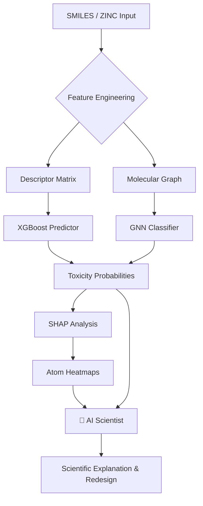

# 🧪 ToxAI — Advanced Drug Toxicity Predictor

> **End-to-End interpretation:** SMILES ⮕ ML Models ⮕ SHAP Explainer ⮕ AI Scientist

---

## 📌 Project Overview
**ToxAI** is a high-performance drug discovery and analysis platform designed to predict molecular toxicity across 12 critical biochemical targets (Tox21 benchmark). By merging **Gradient Boosting (XGBoost)**, **Graph Neural Networks (GNN)**, and **Generative AI (Gemini)**, ToxAI doesn't just predict risk—it explains the biochemical "why" behind it and suggests structural redesigns for medicinal chemists.

---

## ✨ Features
### 🌟 Key Modern Features
- **🧠 Gemini AI Scientist**: Integrates `gemini-1.5-flash` to provide expert biochemical explanations, structural alert rationalization, and actionable drug redesign strategies.
- **📄 Detailed Scientific Reports**: One-click "Toxicity Audit" downloads that bundle molecular descriptors, multi-target predictions, structural alerts, and AI notes into a structured Markdown file.
- **🔥 Atom-Level Interpretability**: Dynamic SHAP heatmaps that highlight the specific atoms driving toxicity for any selected assay target.
- **⚖️ Molecular Comparison**: Side-by-side visual and statistical comparison of two SMILES strings across all Tox21 pathways.
- **💊 Structural Optimization**: Rule-based redesign suggestions to mitigate toxicity while maintaining drug-like properties.
- **Security & Efficiency**: Automated `.env` configuration and an intelligent launcher that handles RDKit and XGBoost dependencies on both Apple Silicon and Intel.

---

## 🛠️ Tech Stack & Tools
| Category | Technologies |
|---|---|
| **Programming** | Python 3.9+ |
| **Classical ML** | XGBoost, Scikit-learn, joblib |
| **Deep Learning** | PyTorch, PyTorch Geometric (GATConv) |
| **Cheminformatics** | RDKit (Molecular Descriptors, SMARTS matching) |
| **Interpretability** | SHAP (Tree & Kernel), Matplotlib, Seaborn |
| **Generative AI** | Google Generative AI (Gemini 1.5 Flash) |
| **Dashboard** | Streamlit, Plotly, CSS-customized components |

---

## 🚀 Installation & Setup

### 1. Clone the Repository
```bash
git clone https://github.com/yash-clouded/drug_toxicity_predictor.git
cd drug_toxicity_predictor
```

### 2. Environment Configuration
ToxAI uses an AI Scientist feature that requires a Gemini API Key.
1. Create a `.env` file in the root directory:
   ```bash
   cp .env.example .env
   ```
2. Open `.env` and paste your key:
   ```bash
   GEMINI_API_KEY=your_actual_key_here
   ```
   *Get a free key at [Google AI Studio](https://aistudio.google.com/app/apikey).*

### 3. Launching the App
The project includes an intelligent shell script that automatically creates a virtual environment, installs optimized dependencies (handling RDKit and libomp for Macs), and launches the Streamlit interface:
```bash
chmod +x run_app.sh
./run_app.sh
```

---

## 📐 Technical Workflow



### **1. Input & Processing**
Molecules are accepted as SMILES strings. RDKit is used to compute normalized molecular descriptors and topological fingerprints.
### **2. Prediction**
The molecule is passed through 12 target-specific XGBoost models and Graph Attention Networks (GATConv).
### **3. Interpretability**
SHAP (Shapley Additive Explanations) is used to attribute prediction scores to specific molecular features and atoms.
### **4. AI Synthesis**
The Gemini API ingests the model scores, SHAP drivers, and structural alerts to generate a professional scientific review.

---

## 📄 License
MIT License. Developed for research and early-stage drug screening.
